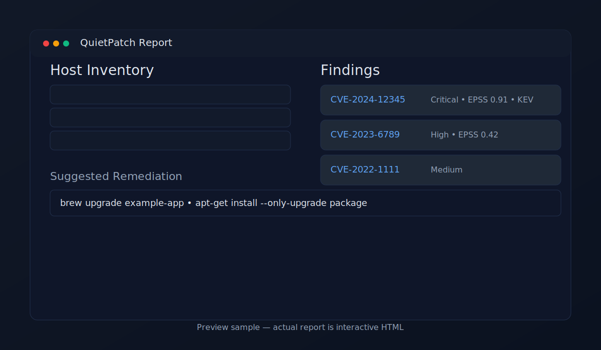

# QuietPatch 🔐

[](https://github.com/Matt-C-G/QuietPatch/actions/workflows/ci.yml)
[](LICENSE)

> Privacy-first vulnerability scanner.  
> Runs fully offline, cross-platform (macOS · Linux · Windows), produces a clean HTML report with clear remediation steps.  
> No telemetry · No auto-patching · Deterministic results.

---

## 🚀 Quick Start (30 seconds)

1. Install

   macOS / Linux
   ```bash
   /bin/bash -c "$(curl -fsSL https://raw.githubusercontent.com/matt-c-g/quietpatch/main/install.sh)"
   ```

   Windows (PowerShell)
   ```powershell
   irm https://raw.githubusercontent.com/matt-c-g/quietpatch/main/install.ps1 | iex
   ```

2. Run a scan

   ```bash
   quietpatch scan --also-report --open
   ```

3. View results
   Report (report.html) opens automatically in your browser.

That’s it ✅

---

## ✨ What You Get

* 📦 Inventory of apps & versions
* 🛡️ CVEs with severity badges (Critical/High/Medium/Low)
* 🚨 KEV + EPSS flagged clearly
* 🔧 Concrete remediation commands (copy-to-clipboard)
* 📑 Deterministic, reproducible report for audits

<p align="center">
  
/p>

---

## 🔒 Why QuietPatch?

* Offline-first: signed CVE DB snapshot; nothing leaves your machine
* No surprises: never auto-patches, all fixes are suggestions
* Cross-platform: works the same on macOS, Linux, and Windows
* Enterprise-ready: systemd / launchd / Task Scheduler templates

---

## ⚙️ Advanced Options

* Policies: tune results with ready-made presets

  ```bash
  quietpatch scan --policy policies/policy-critical-only.yml
  ```
* JSON export: machine-readable for SIEM/ticketing

  ```bash
  quietpatch scan --json-out report.json
  ```
* Update to the latest release

  ```bash
  quietpatch self-update
  ```
* Recurring scans: use included service templates (systemd/launchd/Task Scheduler)

---

## 🛠️ For Developers

```bash
git clone https://github.com/Matt-C-G/QuietPatch.git
cd QuietPatch
python3 -m venv .venv && source .venv/bin/activate
pip install -r requirements.txt
pytest -q
```

---

## 📄 License & Data

* License: [MIT](LICENSE)
* Data sources: [NVD](https://nvd.nist.gov/), [CISA KEV](https://www.cisa.gov/known-exploited-vulnerabilities-catalog), [FIRST EPSS](https://www.first.org/epss/)

---

## 🔑 Verify Downloads

```bash
shasum -a 256 -c SHA256SUMS
```

Optional: verify Minisign signatures (VERIFY.md).

---

## 🙏 Thanks

QuietPatch builds on the open-source security ecosystem.
Thanks to early testers and contributors for shaping the tool.
