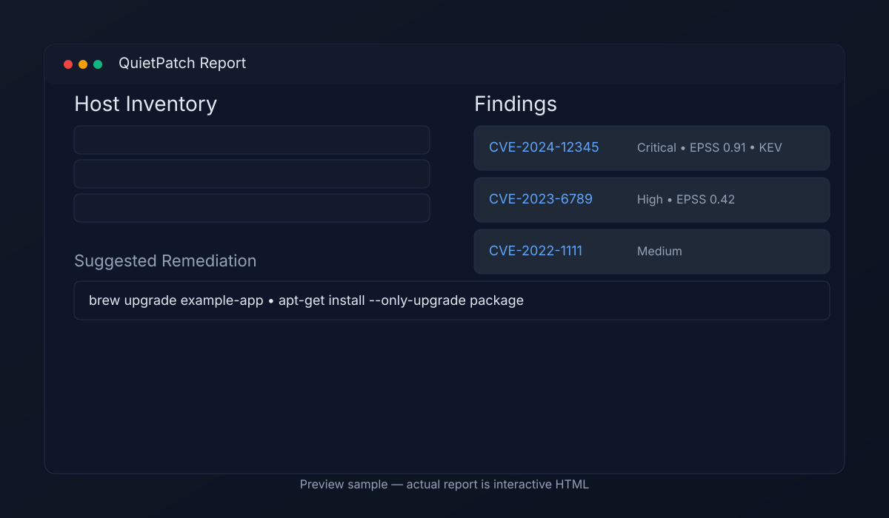

# QuietPatch 


[](https://github.com/Matt-C-G/QuietPatch/actions/workflows/ci.yml)
[](LICENSE)

> Privacy-first vulnerability scanner.  
> Runs fully offline, cross-platform (macOS · Linux · Windows), produces a clean HTML report with clear remediation steps.  
> No telemetry · No auto-patching · Deterministic results.

---

## Live Demo (Safe / Offline)
- **HTML report:** https://matt-c-g.github.io/QuietPatch/demo/
- **Screenshots:** [Demo Report](https://matt-c-g.github.io/QuietPatch/demo/assets/QuietPatch_Demo_Report_Screenshot.svg), [Demo Terminal](https://matt-c-g.github.io/QuietPatch/demo/assets/QuietPatch_Demo_Terminal_Screenshot.svg)

> **Demo Notice:** These screenshots are generated from mock data. No host identifiers or live scan data are included.

### Run locally (no host data)
```bash
python3 -m venv .venv && ./.venv/bin/python -m pip install -e .
mkdir -p demo && ./.venv/bin/quietpatch scan --offline --mock --out demo/report.html
```

---

## Quick Start

## Try Reports (No Install Required)

Generate Executive or Technical reports in under 60 seconds—fully offline, no package install.

> **What this does:** downloads a tiny wrapper (`qp-report`) that calls QuietPatch's report engine.
> **Outputs:** HTML + optional PDF (Note: PDF requires `wkhtmltopdf` in your PATH.)

### macOS / Linux

```bash
# 1) Fetch wrapper
curl -fsSL https://raw.githubusercontent.com/Matt-C-G/QuietPatch/main/scripts/qp-report.py -o qp-report
chmod +x qp-report

# 2) Executive Report (CISO/Board)
./qp-report exec \
  --scan data/scan.json \
  --kpi data/kpi.json \
  --business-units data/business_units.json \
  --actions data/actions.json \
  --approval data/approval.json \
  --watermark "APPROVED • CAB-2025-10-01" \
  --out out/exec-report.html --pdf out/exec-report.pdf

# 3) Technical Report (Engineer Runbook)
./qp-report tech \
  --scan data/scan.json \
  --policy policies/policy.json \
  --actions data/actions.json \
  --approval data/approval.json \
  --out out/tech-report.html --pdf out/tech-report.pdf
```

### Windows (PowerShell)

```powershell
# 1) Fetch wrapper
iwr https://raw.githubusercontent.com/Matt-C-G/QuietPatch/main/scripts/qp-report.ps1 -OutFile qp-report.ps1

# 2) Executive Report (CISO/Board)
.\qp-report.ps1 exec `
  --scan data\scan.json `
  --kpi data\kpi.json `
  --business-units data\business_units.json `
  --actions data\actions.json `
  --approval data\approval.json `
  --watermark "APPROVED • CAB-2025-10-01" `
  --out out\exec-report.html --pdf out\exec-report.pdf

# 3) Technical Report (Engineer Runbook)
.\qp-report.ps1 tech `
  --scan data\scan.json `
  --policy policies\policy.json `
  --actions data\actions.json `
  --approval data\approval.json `
  --out out\tech-report.html --pdf out\tech-report.pdf
```

**Notes**

* **PDF generation**: Requires `wkhtmltopdf` (install via Homebrew, apt, winget, etc.). If unavailable, omit `--pdf`.
* **Offline**: No telemetry. All inputs are local JSON files; outputs are deterministic.
* **Signing (optional)**: Add `--sign --sign-key ~/.config/quietpatch/minisign.key` to embed a Minisign signature.

### Sample Data (for a 60-sec demo)

Use the included sample files or your own scan JSON:

```
data/scan.json
data/kpi.json
data/business_units.json
data/actions.json
data/approval.json
policies/policy.json
```

---

## CLI (Installed)

If you've installed QuietPatch (`pip install quietpatch`), use the console command:

```bash
# Executive
qp-report exec --scan scan.json --kpi kpi.json --out exec.html --pdf exec.pdf

# Technical
qp-report tech --scan scan.json --policy policy.json --out tech.html --pdf tech.pdf
```

---

## CI/CD Examples

**GitHub Actions**

```yaml
- name: Generate Executive Report (no install)
  run: |
    curl -fsSL https://raw.githubusercontent.com/Matt-C-G/QuietPatch/main/scripts/qp-report.py -o qp-report
    chmod +x qp-report
    ./qp-report exec --scan data/scan.json --kpi data/kpi.json \
      --out out/exec.html --pdf out/exec.pdf
```

---

## Complete Demo (One-Liner)

**macOS/Linux:**
```bash
python3 -m venv .venv && . .venv/bin/activate && pip install -e . && pip install jinja2 matplotlib && mkdir -p out && quietpatch scan --offline --mock --json-out out/scan.json && python3 qp_cli.py report report exec --scan out/scan.json --html out/exec-report.html --watermark "DEMO • $(date -u +%Y-%m-%dT%H:%MZ)" && python3 qp_cli.py report report tech --scan out/scan.json --out out/tech-report.html --watermark "DEMO • $(date -u +%Y-%m-%dT%H:%MZ)" && zip -r QuietPatch_Reports_$(date +%Y%m%d).zip out/exec-report.html out/tech-report.html
```

**Windows (PowerShell):**
```powershell
py -3 -m venv .venv; .\.venv\Scripts\Activate.ps1; pip install -e .; pip install jinja2 matplotlib; if (!(Test-Path out)) { New-Item -ItemType Directory out | Out-Null }; quietpatch scan --offline --mock --json-out out\scan.json; py qp_cli.py report report exec --scan out\scan.json --html out\exec-report.html --watermark "DEMO • $(Get-Date -Format u)"; py qp_cli.py report report tech --scan out\scan.json --out out\tech-report.html --watermark "DEMO • $(Get-Date -Format u)"; Compress-Archive -Path out\exec-report.html,out\tech-report.html -DestinationPath ("QuietPatch_Reports_{0}.zip" -f (Get-Date -Format yyyyMMdd)) -Force
```

---

**Supported Python:** 3.11–3.12 (3.13 not yet)

**Install:**
```bash
python -m pip install quietpatch==0.5.0
quietpatch env doctor
quietpatch db fetch
quietpatch scan --offline --html
```

**Verified install (security-conscious):**
```bash
# Download and verify checksums
curl -LO https://github.com/Matt-C-G/QuietPatch/releases/latest/download/SHA256SUMS
shasum -a 256 -c SHA256SUMS

# Install with binary-only mode
python -m pip install quietpatch==0.5.0 --only-binary :all:
```

> ** If install fails:** Use Python 3.12 (`brew install python@3.12` / Winget 'Python 3.12'). We do not support 3.13 yet.

## Downloads (v0.5.0)

**Direct downloads from the [v0.5.0 release](https://github.com/Matt-C-G/QuietPatch/releases/tag/v0.5.0):**

- **Universal wheel**: [`quietpatch-0.5.0-py3-none-any.whl`](https://github.com/Matt-C-G/QuietPatch/releases/download/v0.5.0/quietpatch-0.5.0-py3-none-any.whl) - works on all platforms
- **Source tarball**: [`quietpatch-0.5.0.tar.gz`](https://github.com/Matt-C-G/QuietPatch/releases/download/v0.5.0/quietpatch-0.5.0.tar.gz) - for building from source

**Verify (SHA256):**

The release includes [`SHA256SUMS.txt`](https://github.com/Matt-C-G/QuietPatch/releases/download/v0.5.0/SHA256SUMS.txt). After downloading:

```bash
# macOS/Linux
curl -LO https://github.com/Matt-C-G/QuietPatch/releases/download/v0.5.0/SHA256SUMS.txt
shasum -a 256 -c SHA256SUMS.txt

# Windows (PowerShell)
Get-FileHash .\quietpatch-0.5.0-py3-none-any.whl -Algorithm SHA256
Get-FileHash .\quietpatch-0.5.0.tar.gz -Algorithm SHA256
```

**Install from PyPI:**
```bash
pip install quietpatch==0.5.0
```

> Use `pip install <asset-url>` if you prefer installing directly from a release asset.

---

## Alternative Install Methods

**One-command installers:**

macOS / Linux
```bash
/bin/bash -c "$(curl -fsSL https://raw.githubusercontent.com/Matt-C-G/QuietPatch/main/install.sh)"
```

Windows (PowerShell)
```powershell
irm https://raw.githubusercontent.com/Matt-C-G/QuietPatch/main/install.ps1 | iex
```

**Package managers:**

macOS (Homebrew)
```bash
brew tap matt-c-g/quietpatch && brew install quietpatch
```

Windows (Scoop)
```powershell
scoop bucket add quietpatch https://github.com/Matt-C-G/scoop-quietpatch
scoop install quietpatch
```

**Standalone executables:**
Download from [Releases](https://github.com/Matt-C-G/QuietPatch/releases) - no Python required.

**Docker (Alpine/containerized):**
```bash
# Pull and run
docker run --rm -v "$HOME/.quietpatch:/root/.quietpatch" ghcr.io/matt-c-g/quietpatch:latest env doctor
docker run --rm -v "$HOME/.quietpatch:/root/.quietpatch" ghcr.io/matt-c-g/quietpatch:latest scan --offline --html

# Or build locally
docker build -t quietpatch .
docker run --rm -v "$HOME/.quietpatch:/root/.quietpatch" quietpatch scan --offline --html
```

---

## What You Get

*  Inventory of apps & versions
*  CVEs with severity badges (Critical/High/Medium/Low)
*  KEV + EPSS flagged clearly
*  Concrete remediation commands (copy-to-clipboard)
*  Deterministic, reproducible report for audits

<p align="center">
  
</p>

---

## Why QuietPatch?

* **Privacy-first**: No telemetry. The app never sends data. Nightly jobs run on our infra against our test images only.
* **Offline-first**: signed CVE DB snapshot; nothing leaves your machine
* **No surprises**: never auto-patches, all fixes are suggestions
* **Cross-platform**: works the same on macOS, Linux, and Windows
* **Enterprise-ready**: systemd / launchd / Task Scheduler templates

---

## Advanced Options

* Policies: tune results with ready-made presets

  ```bash
  quietpatch scan --policy policies/policy-critical-only.yml
  ```
* JSON export: machine-readable for SIEM/ticketing

  ```bash
  quietpatch scan --json-out report.json
  ```
* Doctor: diagnose environment and provide fixes

  ```bash
  quietpatch doctor --open-check
  ```
* Recurring scans: use included service templates (systemd/launchd/Task Scheduler)

---

## For Developers

```bash
git clone https://github.com/Matt-C-G/QuietPatch.git
cd QuietPatch
python3 -m venv .venv && source .venv/bin/activate
pip install -r requirements.txt
pytest -q
```

---

## License & Data

* License: [MIT](LICENSE)
* Data sources: [NVD](https://nvd.nist.gov/), [CISA KEV](https://www.cisa.gov/known-exploited-vulnerabilities-catalog), [FIRST EPSS](https://www.first.org/epss/)

## Version Support Policy

**We support exactly two CPython minor versions:**
- **Current**: Python 3.11, 3.12
- **Next**: Python 3.12, 3.13 (when 3.13 support is added)
- **Deprecated**: None currently
- **End of life**: Python 3.10 and below, 3.14 and above

**Policy:**
- New versions added only after thorough testing with wheels + constraints
- Old versions deprecated when new ones are added
- Python 3.13 support will be added in a future release
- See [SUPPORT_MATRIX.md](SUPPORT_MATRIX.md) for full details

## Security & Integrity

**Database Security:**
- All catalogs are minisign-verified before extraction
- Path traversal protection prevents `../` attacks
- Downgrade protection blocks rollback attacks
- Epoch-based versioning ensures monotonic updates

**Platform Support:**
- Alpine not supported; use Docker image
- Two Python minors supported (3.11/3.12)
- No telemetry; diagnostics bundle is local-only and opt-in

**Supply Chain:**
- Cryptographic verification with Minisign signatures
- Binary-only installation option for security-conscious users
- Deterministic reports with content hashing
- Automated security testing in CI/CD

---

## Troubleshooting

| Symptom | Cause | Fix |
|---|---|---|
| "Requires Python ≥3.11" | Using 3.9/3.10/3.13 | Install 3.12; re-run install |
| "zstandard not found" | Env resolved wrong dep | `python -m pip install "zstandard>=0.22,<0.23"` |
| "DB not found (offline)" | No catalog downloaded | `quietpatch db fetch` |
| Gatekeeper blocks (macOS) | Unsigned | `xattr -dr com.apple.quarantine /path/to/python /usr/local/bin/quietpatch` |
| SARIF empty in CI | Wrong path | Ensure `--sarif out.sarif` and upload step |

**Quick diagnosis:**
```bash
quietpatch env doctor  # Shows exact fix commands
```

## Verify Downloads

```bash
shasum -a 256 -c SHA256SUMS
```

Optional: verify Minisign signatures (VERIFY.md).

Windows Authenticode
```powershell
Get-AuthenticodeSignature .\quietpatch-windows-x64.exe | Format-List Status, StatusMessage, SignerCertificate, TimeStamperCertificate
# Expect Status: Valid
```

macOS notarization
```bash
spctl --assess -vv quietpatch-macos-arm64.zip   # Expect: accepted
xcrun stapler validate quietpatch-macos-arm64.zip  # Expect: The validate action worked!
```

---

## Thanks

QuietPatch builds on the open-source security ecosystem.
Thanks to early testers and contributors for shaping the tool.
